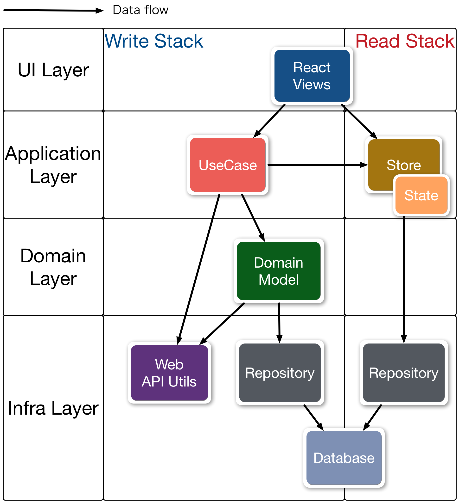

# [Almin.js](https://github.com/almin/almin) 

<!-- textlint-disable no-dead-link -->

<!-- textlint-enable no-dead-link -->

Flux/CQRS patterns for JavaScript application.

Write code thinking :)

## Why?

Now, We can implement web applications with Flux or Redux etc...

But, I often hear a story that "Control flow of Flux/Redux is cool, but where to implement domain logic."

I think that people skip to Flux/Redux from MV* pattern.

> MV* --> ( Missing things ) --> Flux/Redux(CQRS+EventSourcing)

Almin aim to fill the **Missing things** between MV* and Flux/Redux.

## Features

Almin provides some patterns, is not a framework.

- Testable
- Scalable
- Responsibility Layers patten - well-known as DDD(Domain-Driven Design)/CQRS
- Support [TypeScript](https://www.typescriptlang.org/ "TypeScript") and [Flow](https://flow.org/ "FlowType")

Almin is an implementation of Read/Write Stack Architecture that is well-known as Flux/CQRS.

## Installation

    npm install almin

You'll also need a Promise polyfill for [older browsers](https://caniuse.com/).

    npm install es6-promise

## Documentation

:memo: Please See [https://almin.js.org/](https://almin.js.org/) for details.

- :book: Documentation of Almin
- [https://almin.js.org/](https://almin.js.org/)

## What is Almin?

Almin provides Flux/CQRS patterns for JavaScript applications.

It aims to create a scalable app.

The above figure is overview of Almin architecture that is similar to CQRS([Command Query Responsibility Segregation](https://martinfowler.com/bliki/CQRS.html "Command Query Responsibility Segregation")).

But, Almin is not a framework, provides only these components

- Dispatcher
- Context
- UseCase
- Store
- StoreGroup

Other components like Domain, Repository and State are written by you!

Of course, Almin help you to write other components.

Also, You may notice that these components are similar to [Flux](https://github.com/facebook/flux "Flux") architecture.

Almin is also a flux implementation library. :thumbsup:

| Almin      | Flux          | Redux                  |
|------------|---------------|------------------------|
| Dispatcher | Dispatcher    | store.dispatch         |
| Context    | Container     | Middleware/React Redux |
| UseCase    | ActionCreator | Actions                |
| Store      | Store         | Store                  |
| StoreGroup | Container     | combineReducers        |
| (State)    | Store         | Reducer                |
| (Domain)   |               |                        |
|(Repository)|               |                        |

:memo: `State`, `Domain` and `Repository` is optional on Almin,
because the best for these components is vary based on application.

Almin has not a perfect solution for an application, but we can write code thinking.

We are going to learn two architectures(Flux/CQRS) using Almin :)

## Real Examples

Welcome to pull request!

- [azu/presentation-annotator: viewing presentation and annotate.](https://github.com/azu/presentation-annotator)
- [morpheme-match/website at master · azu/morpheme-match](https://github.com/azu/morpheme-match/tree/master/website)
- [azu/faao: Faao is a GitHub issue/pull-request client on Electron.](https://github.com/azu/faao "azu/faao: Faao is a GitHub issue/pull-request client on Electron.") - Full TypeScript example

## Presentations

- The concept of Almin (English)
    - [The Concept of Almin](http://azu.github.io/slide/2017/almin/concept-of-almin.html "The Concept of Almin")
- The architecture of Almin (Japanese)
    - [Almin.js | JavaScriptアーキテクチャ](http://azu.github.io/slide/2016/child_process_sushi/almin-javascript-architecture.html "Almin.js | JavaScriptアーキテクチャ")
- Patterns For Large-Scale JavaScript Application Architecture (Japanese)
    - [複雑なJavaScriptアプリケーションを考えながら作る話](http://azu.github.io/slide/2016/react-meetup/large-scale-javascript.html)
    - [azu/large-scale-javascript: 複雑なJavaScriptアプリケーションを作るために考えること](https://github.com/azu/large-scale-javascript)
- DDD and Almin (Japanese)
    - [Faao - ドメイン駆動設計で作るGitHub Issue Client -](http://azu.github.io/slide/2017/teppeis-sushi/client-side-ddd-on-github.html "Faao - ドメイン駆動設計で作るGitHub Issue Client -")

## Packages

The Almin repo is managed as a [monorepo](https://github.com/babel/babel/blob/master/doc/design/monorepo.md "monorepo"); it's composed of npm packages.

### Core

| Package | Version | Description|
|--------|-------|-------|
| [`almin`](./packages/almin) |  | `almin` itself |

### Integrations

| Package | Version | Description|
|--------|-------|-------|
| [`almin-react-container`](./packages/almin-react-container) |  | Integration with React |

### Utilities

| Package | Version | Description|
|--------|-------|-------|
| [`almin-logger`](./packages/almin-logger) |  | console logger | 
| [`almin-devtools`](https://github.com/almin/almin-devtools) |  | browser debugging extension | 

## Contributing

Please see [CONTRIBUTING.md](./.github/CONTRIBUTING.md) for more details.

1. Fork it!
2. Create your feature branch: `git checkout -b my-new-feature`
3. Commit your changes: `git commit -am 'Add some feature'`
4. Push to the branch: `git push origin my-new-feature`
5. Submit a pull request :D

## License

MIT
