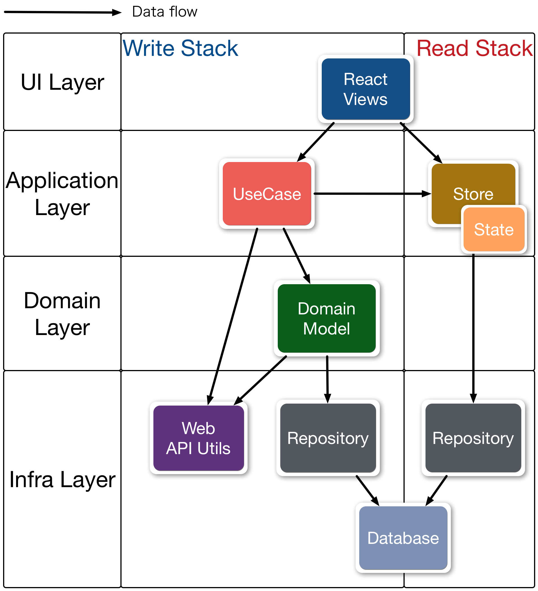

Previously, you have seen [components of almin](./Components.md).

[examples/introduction](https://github.com/almin/almin/tree/master/examples/introduction) is a simple Hello World app that shows the components in a single file.

> Source: [`introduction/index.js`](https://github.com/almin/almin/tree/master/examples/introduction/index.js)
``` javascript
"use strict";
// Hello World in a single file
import { Context, Dispatcher, Store, UseCase } from "almin";
// Store that has the state
class CounterStore extends Store {
    constructor() {
        super();
        this.state = {
            name: "No Name"
        };
    }
    // receive payload from UseCase#dispatch
    receivePayload(payload) {
        if (payload.type === "HELLO") {
            this.setState({
                name: payload.name
            });
        }
    }

    // return own state
    getState() {
        return this.state;
    }
}
// UseCase
class HelloUseCase extends UseCase {
    execute(name) {
        // Dispatch payload ---> CounterStore
        this.dispatch({
            type: "HELLO",
            name
        });
    }
}
// Context is communicator between Store and UseCase
const counterStore = new CounterStore();
const context = new Context({
    dispatcher: new Dispatcher(),
    store: counterStore
});
// View
const render = () => {
    // Update view with state
    const state = context.getState();
    document.body.innerHTML = `<div>
      <h1>Hello ${state.name}!</h1>
      <input id="js-name" placeholder="Your name"/>
      <button type="submit" id="js-button">Hello</button>
</div>`;
    // Execute UseCase
    document.getElementById("js-button").addEventListener("click", () => {
        const name = document.getElementById("js-name").value;
        // execute HelloUseCase with name arguments.
        context.useCase(new HelloUseCase()).execute(name);
    });
};
// If the store's state is changed, does call render
context.onChange(render);
// Initial render
render();

```

### ⚠️ Real example

[examples/introduction](https://github.com/almin/almin/tree/master/examples/introduction) prefers to [concept of components](./Components.md) than correctness for implementation.

You want to know real implementation and see other examples.

You can see an actual example in [Creating Counter App](counter/README.md) and other examples.

## Others



The Hello World app doesn't say all thing of Almin.

- **UseCase** is also entry point of **domain** model
- **Domain** is business logic on your application
- **StoreGroup** can handling multiple **Store**s
- **Store** can apply reducer pattern like [Redux](https://github.com/reactjs/redux "Redux")
- etc...

If you want know these, please see [TodoMVC tutorial](tutorial/todomvc/README.md) and other examples.

- [examples/shopping-cart](https://github.com/almin/almin/tree/master/examples/shopping-cart)
