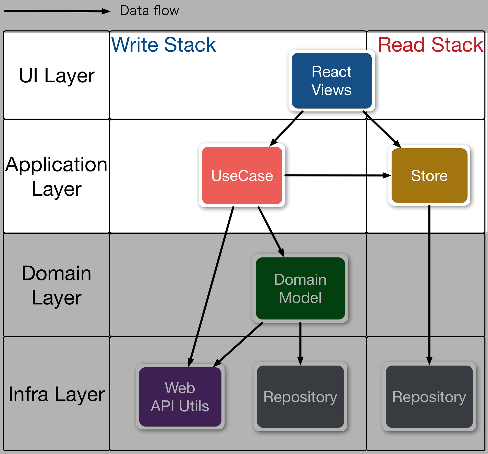

In this guide, we’ll walk through the process of creating a simple Todo app.


This todo app is based on [TodoMVC](http://todomvc.com/ "TodoMVC").

## Source Code

You can get source code for counter app from here

- https://github.com/almin/almin/tree/master/examples/todomvc

```sh
git clone https://github.com/almin/almin.git

cd almin/examples/todomvc
npm install
npm start
# manually open
open http://localhost:8080/
```

## What's learn from Todo app

- What is domain layer?
    - POJO(Plain Old JavaScript Object)
- What is infra layer?
    - Repository
- Which one should you used repository or store?
    - Where is persistent data? - repository
    - Where is data for view? - store

## The purpose of Todo app

Todo app has these UseCases.

- [AddTodoItem.js](https://github.com/almin/almin/blob/master/examples/todomvc/src/usecase/AddTodoItem.js)
- [FilterTodoList.js](https://github.com/almin/almin/blob/master/examples/todomvc/src/usecase/FilterTodoList.js)
- [RemoveAllCompletedItems.js](https://github.com/almin/almin/blob/master/examples/todomvc/src/usecase/RemoveAllCompletedItems.js)
- [RemoveTodoItem.js](https://github.com/almin/almin/blob/master/examples/todomvc/src/usecase/RemoveTodoItem.js)
- [ToggleAllTodoItems.js](https://github.com/almin/almin/blob/master/examples/todomvc/src/usecase/ToggleAllTodoItems.js)
- [ToggleTodoItem.js](https://github.com/almin/almin/blob/master/examples/todomvc/src/usecase/ToggleTodoItem.js)
- [UpdateTodoItemTitle.js](https://github.com/almin/almin/blob/master/examples/todomvc/src/usecase/UpdateTodoItemTitle.js)

and system UseCase

- [CreateDomainUseCase.js](https://github.com/almin/almin/blob/master/examples/todomvc/src/usecase/CreateDomainUseCase.js)

## Story

We'll implement following work flow and see it.

1. Add Todo item
2. Toggle Todo item's status
3. ... Loop 1,2
4. Filter Todo list and show only non-completed todo items.

## Let's creating, before

Previously, We learn flux pattern to create [counter app](../../counter/README.md).



In this guide, We learn basic CQRS(Command Query Responsibility Segregation) pattern using Almin.

CQRS split that conceptual model into separate models - Command(Write) model and Query(Read) model.


In the figure, We called

- Command(Write) model "Write Stack" (Left side of the figure)
    - "Write Stack" get often complex.
    - Because, it has business logic that is well-known as **domain model**.
- Query(Read) model "Read Stack" (Right side of the figure)
    - "Read Stack" is similar concept of ViewModel and Store.

### Domain model

[Domain model](https://en.wikipedia.org/wiki/Domain_model "Domain model") is a object/class that has both behavior and data.
In other word, domain model has property(data) and method(behavior).

## Let's create domain model!

We want to create Todo app, then create `???` as domain model.

Yes, `???` is just `TodoList`!

```js
class TodoList {
    // data and behavior
}
```

### TodoList

`TodoList` class has business logic and manage todo item.

*Todo item* is also domain model.
We going to implement `TodoItem` as value object.

#### TodoItem is value object

`TodoItem` is a simple class that has these data

- `id`: identifier
- `title`: todo title
- `completed`: true or false

> Source: [`todomvc/src/domain/TodoList/TodoItem.js`](https://github.com/almin/almin/tree/master/examples/todomvc/src/domain/TodoList/TodoItem.js)
``` javascript
"use strict";
const uuid = require("uuid");
export default class TodoItem {
    constructor({ id, title, completed }) {
        this.id = id || uuid();
        this.title = title;
        this.completed = completed;
    }

    updateItem(updated) {
        return new TodoItem(Object.assign({}, this, updated));
    }
}

```

#### TodoList is domain model

`TodoList` class is domain model.
It should be plain JavaScript object,

We want to implement that adding TodoItem to TodoList.

```js
"use strict";
export default class TodoList {
    constructor() {
        /**
         * @type {TodoItem[]}
         * @private
         */
        this._items = [];
    }

    /**
     * @param {TodoItem} todoItem
     * @return {TodoItem}
     */
    addItem(todoItem) {
        this._items.push(todoItem);
        return todoItem;
    }
}
```

We can focus on business logic because domain model is a just plain JavaScript.

### Where domain model are stored?

Now, we can create instance of domain model like this:

```js
const todoList = new TodoList();
const todoItem = new TodoItem({ ... });
todoList.addTodo(todoItem);
```

But, How to store instance of domain(`TodoList`) as persistence.

We want to introduce **Repository* object.
Repository store domain model for perpetuation.

In the case, repository store domain model into memory database.

Repository is simple class that has these feature:

- Can read/write memory database - memory database is a just `Map` object
- Write domain instance into memory database
- Read domain instance from memory database
- When update memory database, emit "Change" event to subscriber
    - Repository is a just EventEmitter


We want to store `TodoList` instance to the repository.
As a result, We have created `TodoListRepository`.

> Source: [`todomvc/src/infra/TodoListRepository.js`](https://github.com/almin/almin/tree/master/examples/todomvc/src/infra/TodoListRepository.js)
``` javascript
"use strict";
const EventEmitter = require("events");
const REPOSITORY_CHANGE = "REPOSITORY_CHANGE";
import TodoList from "../domain/TodoList/TodoList";
import MemoryDB from "./adpter/MemoryDB";
// Collection repository
export class TodoListRepository extends EventEmitter {
    constructor(database = new MemoryDB()) {
        super();
        /**
         * @type {MemoryDB}
         */
        this._database = database;
    }

    /**
     * @param id
     * @private
     */
    _get(id) {
        // Domain.<id>
        return this._database.get(`${TodoList.name}.${id}`);
    }

    find(todoList) {
        return this._get(todoList.id);
    }

    /**
     * @returns {TodoList|undefined}
     */
    lastUsed() {
        const todoList = this._database.get(`${TodoList.name}.lastUsed`);
        if (todoList) {
            return this._get(todoList.id);
        }
    }

    /**
     * @param {TodoList} todoList
     */
    save(todoList) {
        this._database.set(`${TodoList.name}.lastUsed`, todoList);
        this._database.set(`${TodoList.name}.${todoList.id}`, todoList);
        this.emit(REPOSITORY_CHANGE, todoList);
    }

    /**
     * @param {TodoList} todoList
     */
    remove(todoList) {
        this._database.delete(`${TodoList.name}.${todoList.id}`);
        this.emit(REPOSITORY_CHANGE);
    }

    onChange(handler) {
        this.on(REPOSITORY_CHANGE, handler);
    }
}
// singleton
export default new TodoListRepository();

```

Repository should be persistence object.
In other words, create repository instance as singleton.

Singleton? Does it may make dependencies problem?

Of course, We can resolve that dependencies issue by DIP([Dependency inversion principle](https://en.wikipedia.org/wiki/Dependency_inversion_principle "Dependency inversion principle")).

### DIP

[Dependency inversion principle](https://en.wikipedia.org/wiki/Dependency_inversion_principle "Dependency inversion principle") is well-known layers pattern.


Domain should not dependent to repository.
Because, Domain don't know how to store itself.
But, Repository can dependent to domain.

## When is domain model created?

It is a just System UseCase.

`CreateDomainUseCase` is

- Actor: System
- Purpose: initialize domain model and save this to repository

Execute [CreateDomainUseCase.js](https://github.com/almin/almin/tree/master/examples/todomvc/src/usecase/CreateDomainUseCase.js) and initialize `TodoList` domain and store the instance to repository.

We can put this to `index.js` that is actual entry point of this application.

```jsx
// create domain model and store to repository
appContext.useCase(CreateDomainUseCaseFactory.create()).execute().then(() => {
    // mount app view
    ReactDOM.render(<TodoApp appContext={appContext}/>, document.getElementById("todoapp"));
});
```

## UseCase: AddTodoItem 

Let's implement business login to `TodoList`.

[AddTodoItem](https://github.com/almin/almin/blob/master/examples/todomvc/src/usecase/AddTodoItem.js) UseCase does following steps:

1. Get TodoList from repository
2. Create new TodoItem
3. Add New TodoItem to TodoList
4. Save TodoList to repository

Execution steps:

```js
    execute(title) {
        // Get todoList from repository
        const todoList = this.todoListRepository.lastUsed();
        // Create TodoItem
        const todoItem = new TodoItem({title});
        // Add TodoItem
        todoList.addItem(todoItem);
        // Save todoList to  repository
        this.todoListRepository.save(todoList);
    }
```

All of AddTodoItem:

> Source: [`todomvc/src/usecase/AddTodoItem.js`](https://github.com/almin/almin/tree/master/examples/todomvc/src/usecase/AddTodoItem.js)
``` javascript
"use strict";
import { UseCase } from "almin";
import todoListRepository, { TodoListRepository } from "../infra/TodoListRepository";
import TodoItem from "../domain/TodoList/TodoItem";
export class AddTodoItemFactory {
    static create() {
        return new AddTodoItemUseCase({
            todoListRepository
        });
    }
}

export class AddTodoItemUseCase extends UseCase {
    /**
     * @param {TodoListRepository} todoListRepository
     */
    constructor({ todoListRepository }) {
        super();
        this.todoListRepository = todoListRepository;
    }

    execute(title) {
        // Get todoList from repository
        const todoList = this.todoListRepository.lastUsed();
        // Create TodoItem
        const todoItem = new TodoItem({ title });
        // Add TodoItem
        todoList.addItem(todoItem);
        // Save todoList to  repository
        this.todoListRepository.save(todoList);
    }
}

```

#### Factory of UseCase

You notice about `AddTodoItemFactory`.

`AddTodoItemFactory` is not must, but it help to write tests.
We can write test for `AddTodoItem` UseCase.

> Source: [`todomvc/test/UseCase/AddTodoItem-test.js`](https://github.com/almin/almin/tree/master/examples/todomvc/test/UseCase/AddTodoItem-test.js)
``` javascript
"use strict";
const assert = require("power-assert");
import MemoryDB from "../../src/infra/adpter/MemoryDB";
import TodoList from "../../src/domain/TodoList/TodoList";
import { TodoListRepository } from "../../src/infra/TodoListRepository";
import { AddTodoItemUseCase } from "../../src/usecase/AddTodoItem";
describe("AddTodoItem", function() {
    it("should add TodoItem with title", function() {
        const mockTodoList = new TodoList();
        // prepare
        const todoListRepository = new TodoListRepository(new MemoryDB());
        todoListRepository.save(mockTodoList);
        // initialize
        const useCase = new AddTodoItemUseCase({
            todoListRepository
        });
        const titleOfAdding = "ADDING TODO";
        // Then
        todoListRepository.onChange(() => {
            // re-get todoList
            const storedTodoList = todoListRepository.find(mockTodoList);
            const todoItem = storedTodoList.getAllTodoItems()[0];
            assert.equal(todoItem.title, titleOfAdding);
        });
        // When
        useCase.execute(titleOfAdding);
    });
});

```

This pattern is well-known as [Dependency injection](https://en.wikipedia.org/wiki/Dependency_injection "Dependency injection")(DI).

#### Conclusion of UseCase

`AddTodoItem` UseCase do that add TodoItem and save it.

Next, We want to render this result that new TodoItem is added.

### TodoStore 

TodoStore is a almin's Store class.

In [Counter app example](../../counter/README.md), you already know about **Store**.

Almin's Store 

- has **State** instance
- can receive the dispatched *event* from a UseCase. 
- :new: can observe repository.

### TodoStore observe repository

Repository is implemented as a singleton.
You easy to observe the repository.

But We want to implement Store that it should received repository as a constructor arguments.

Why? It is a for testing.
You already know this pattern as Dependency injection.

```js
export default class TodoStore extends Store {
    // TodoListRepository instance as arguments
    // It is received from `AppStoreGroup` that is explained below.
    constructor({todoListRepository}) {
        // ...
    }
}
```

Return to observe the repository. 

You can use `TodoListRepository#onChange` for observing repository. 

1. Observe change of repository 
2. When `todoListRepository` is changed, try to update state

```js
"use strict";
import { Store } from "almin";
import TodoState, { FilterTypes } from "./TodoState";
export default class TodoStore extends Store {
    /**
     * @param {TodoListRepository} todoListRepository
     */
    constructor({ todoListRepository }) {
        super();
        // Initial State
        this.state = new TodoState({
            items: [],
            filterType: FilterTypes.ALL_TODOS
        });
        this.todoListRepository = todoListRepository;
        // When `todoListRepository` is changed, try to update state
        this.todoListRepository.onChange(todoList => {
            this.setState(this.state.merge(todoList));
        });
    }

    receivePayload(payload) {
        this.setState(this.state.reduce(payload));
    }

    getState() {
        return this.state;
    }
}
```

In other way, you can implement updating state from changes of `todoListRepository`.
Because, `Store#receivePayload` is called in the [Almin life-cycle](tips/usecase-lifecycle.md).

- onDispatch
- onError
- onDidExecuteEachUseCase
- onCompleteEachUseCase if needed

So, you can write following:

> Source: [`todomvc/src/store/TodoStore/TodoStore.js`](https://github.com/almin/almin/tree/master/examples/todomvc/src/store/TodoStore/TodoStore.js)
``` javascript
"use strict";
import { Store } from "almin";
import TodoState, { FilterTypes } from "./TodoState";
export default class TodoStore extends Store {
    /**
     * @param {TodoListRepository} todoListRepository
     */
    constructor({ todoListRepository }) {
        super();
        // Initial State
        this.state = new TodoState({
            items: [],
            filterType: FilterTypes.ALL_TODOS
        });
        this.todoListRepository = todoListRepository;
    }

    // Update state
    receivePayload(payload) {
        const todoList = this.todoListRepository.lastUsed();
        if (!todoList) {
            return;
        }
        const newState = this.state.merge(todoList).reduce(payload);
        this.setState(newState);
    }

    // Read state
    getState() {
        return this.state;
    }
}

```

And you can see the test for `TodoStore.js`

[examples/todomvc/test/store/TodoStore-test.js](https://github.com/almin/almin/tree/master/examples/todomvc/test/store/TodoStore-test.js)

#### :memo: Which is better?

Which is better place for updating state?

- `Repository#onChange` vs. `Store#receivePayload`

TL;DR: Case by Case, But we recommended that do update in the `Store#receivePayload`.

It is difference that `Repository#onChange` is outside of almin, `Store#receivePayload` is inside of almin.
To update state should be done in almin life-cycle, because almin can optimize the updating process.

`Repository#onChange`:

- Pros:
    - The cost of reading from repository is minimal 
- Cons:
    - To update the state out of almin life-cycle
    - Increase listen count of observing the repository in the store

`Store#receivePayload`:

- Pros:
    - To update the state in of almin life-cycle
    - Can put state updating code at one part  
- Cons:
    - Store implicitly depended on almin
        - It means that to test the store a bit complex maybe.
        - We recommended that test State instead of Store class.

### TodoState

`TodoState` is a State class.

There are **two way** of updating store:

- Receive `TodoList` object and return new `TodoState`
- Receive payload object and return new `TodoState`
    - See [Counter app example](../../counter/README.md)

You can implement `TodoState` like this.

```
export default class TodoState {
    /**
     * @param {TodoItem[]} items
     * @param {string} filterType
     */
    constructor({items, filterType} = {}) {
        this.items = items;
        this.filterType = filterType;
    }
    
    /**
     * @param {TodoList} todoList
     * @returns {TodoState}
     */
    merge(todoList) {
        const items = todoList.getAllTodoItems();
        return new TodoState(Object.assign(this, {
            items
        }));
    }
}
```

### StoreGroup

Real application not only have a single state, but have many state.

Almin has `StoreGroup` utility class that collection of stores.

`AppStoreGroup` pass `TodoListRepository` instance to `TodoStore`. 

> Source: [`todomvc/src/store/AppStoreGroup.js`](https://github.com/almin/almin/tree/master/examples/todomvc/src/store/AppStoreGroup.js)
``` javascript
"use strict";
import { StoreGroup } from "almin";
import TodoStore from "./TodoStore/TodoStore";
import todoListRepository from "../infra/TodoListRepository";
export default class AppStoreGroup {
    static create() {
        return new StoreGroup({
            todoState: new TodoStore({ todoListRepository })
        });
    }
}

```

After that, you should initialize Almin's `Context` with `AppStoreGroup`.

```js
// store
import AppStoreGroup from "./store/AppStoreGroup";
import {Context, Dispatcher}  from "almin";
const dispatcher = new Dispatcher();
// context connect dispatch with stores
const appContext = new Context({
    dispatcher,
    store: AppStoreGroup.create()
});
```

## StoreGroup -> View

Entry point of App's view observe `TodoStore` via Almin's `Context`.

The entry point is `TodoApp.react.js`.

- [examples/todomvc/src/components/TodoApp.react.js](https://github.com/almin/almin/blob/master/examples/todomvc/src/components/TodoApp.react.js)

As a result, when `TodoStore` is changed, `TodoApp` is updated. 

> UseCase -> Domain -> Repository -> Store -> (New State) -> View

It is **Unidirectional data flow**!


TodoMVC has other UseCases.

You can implement these in a similar way of `AddTodoItem` or [counter app](../../counter/README.md)

- [FilterTodoList.js](https://github.com/almin/almin/blob/master/examples/todomvc/src/usecase/FilterTodoList.js)
- [RemoveAllCompletedItems.js](https://github.com/almin/almin/blob/master/examples/todomvc/src/usecase/RemoveAllCompletedItems.js)
- [RemoveTodoItem.js](https://github.com/almin/almin/blob/master/examples/todomvc/src/usecase/RemoveTodoItem.js)
- [ToggleAllTodoItems.js](https://github.com/almin/almin/blob/master/examples/todomvc/src/usecase/ToggleAllTodoItems.js)
- [ToggleTodoItem.js](https://github.com/almin/almin/blob/master/examples/todomvc/src/usecase/ToggleTodoItem.js)
- [UpdateTodoItemTitle.js](https://github.com/almin/almin/blob/master/examples/todomvc/src/usecase/UpdateTodoItemTitle.js)

## Conclusion

Almin provide two way for updating app's state.


- Fast path
    - Dispatch events system
    - It is well-known as Flux
- Long path
    - Changes of Domain and Repository
    - It similar with server side architecture

Complex Web application need to both.

For example, Animation must to use Fast path.
On the other hand, complex business logic should be written in domain models.

> View -> UseCase -> (Thinking Point) -> Store

We can write code thinking :)

- [ ] Help to improve this document!
