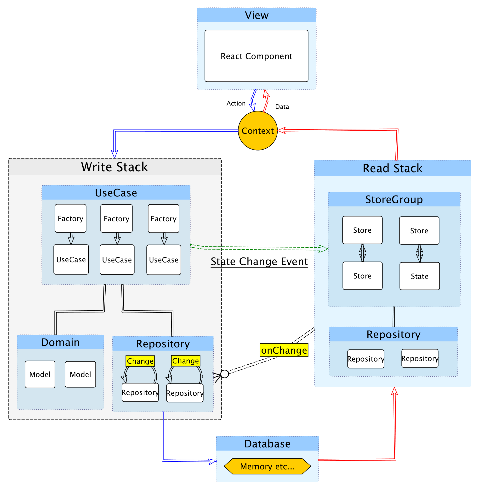

# Component of Almin

Abstract of Almin.

## View

Almin is not View library.
Almin is not dependent on any view library.

We can create **View** using UI library like [React](https://facebook.github.io/react/ "React").
Next, We want to add **action** to a component of **View**.

```js
import React from "react";
class MyComponent extends React.Component {
    render(){
        return <div className="MyComponent">
            <button>Awesome button</button>
        </div>;
    }
}
```

## UseCase

Almin has `UseCase` class that is similar with ActionCreator.

For example, We want to add **action** to the `<button>Awesome button</button>` and 
We going to create **UseCase** that `dispatch` action.

```js
import {UseCase} from "almin";
class AwesomeUseCase extends UseCase {
    execute(){
        // dispatch **action**
        this.dispatch({
            type: "AwesomeUseCase"
        });
    }
}
```

Clicking the button and dispatch **action**.
In other word, Clicking the button and executing **UseCase** that dispatch **action**.

Executing? Directly way is following the code, but we want **logging** the execution.

```js
const useCase = new AwesomeUseCase();
useCase.execute();
```

## Context

Almin has `Context` class for logging and communicating with **Store**.

```js
import {Context} from "almin";
const context = new Context({ ... });
// context execute UseCase
const useCase = new AwesomeUseCase();
context(useCase).execute();
// Context#onDispatch etc... for logging!!
```

When the awesome button is clicked, execute the `AwesomeUseCase`:

```js
import {Context} from "almin";
import React from "react";
const context = new Context({ ... });
const onClick = () => {
    const useCase = new AwesomeUseCase();
    context(useCase).execute();
}
class MyComponent extends React.Component {
    render(){
        return <div className="MyComponent">
            <button onClick={onClick}>Awesome button</button>
        </div>;
    }
}
```

------

### Summarize the points so far

- Creating **View** using UI library
- **Action** is dispatched in **UseCase**
- **Context** connect **View** with **UseCase** 

-------

## Store

We can dispatch **action** from UI events like clicking!
But, How to update view?

Almin has `Store` that is well-known application state container.
Store, State and Reducer is just a pattern of application.

We want to update state if `AwesomeUseCase` is dispatched.
Simply write following to `AppStore`.

```js
import {Store} from "almin";
class AppStore extends Store {
    constructor(){
        super(){
        this.state = {};
        // Receive **Action** from UseCase via Context
        this.onDispatch(payload => {
            switch(payload.type){
                case "AwesomeUseCase":
                    // update state
                default:
                    return
            }
        });
    }
}
```

What's the hub between `AwesomeUseCase` and `AppStore`?
Yes, `Context` have a role of hub.

`AwesomeUseCase` dispatch **action** -> Context -> AppStore receive the **action**

### Store -> View

View to know when store is updated.

What's the hub between `AppStore` and **View**?
`Context` have the role of hub again!

```js
import React from "react";
import {Context} from "almin";
const appStore = new AppStore();
const context = new Context({ store: appStore });
context.onChange((changedStore) => {
    // subscribe the change of Store
    // update View
});
```

## Conclusion

We learn simply data flow of Almin.

1. Create View
2. Click Button
3. Context execute UseCase
4. UseCase dispatch action
5. Context pass the action to Store
6. Store is updated and the callback of `context.onChange` is called.
7. Update View!
8. :recycle:

You can see actual example in [Creating Counter App](../counter/).



This page not say all thing of Almin.

- **UseCase** is also entry point of **domain** model.
- **StoreGroup** can handling multiple **Store**s.
- **Store** can apply reducer pattern like [Redux](https://github.com/reactjs/redux "Redux").
- etc...

### End

Almin don't aim to be framework that contain all things.
We can learn some patterns for JavaScript Application.

After all, We should write code thinking :)

Almin aim to be the based of thinking.