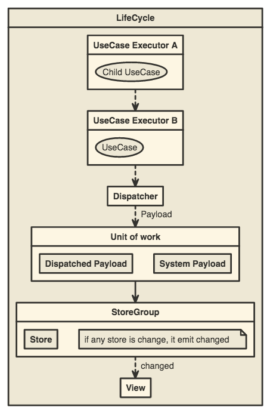

# Principle

This document describe almin's principles:

## Unit of work

Almin has a [Unit of Work](https://martinfowler.com/eaaCatalog/unitOfWork.html "Unit of Work").
It is a actual internal class and almin apply Unit of Work pattern.

- Unit of Work can stop unintended updating of `StoreGroup`
- In other word, The user can control updating of `StoreGroup` while some UseCase is executing 

Following figure describe it:

[][unit-of-work]

[unit-of-work]: http://www.nomnoml.com/#view/%23padding%3A%2010%0A%0A%5BUseCase%7C%0A%20%20%20%20%5BUseCase%20Executor%20A%7C%0A%20%20%20%20%20%20%20%20%5B%3Cusecase%3EChild%20UseCase%5D%0A%20%20%20%20%5D%20--%3E%20%5BUseCase%20Executor%20B%5D%0A%20%20%20%20%5BUseCase%20Executor%20B%7C%0A%20%20%20%20%20%20%20%20%5B%3Cusecase%3EUseCase%5D%0A%20%20%20%20%5D%0A%5D%0A%5BUnit%20of%20Work%7C%0A%20%20%20%20%5BCommitments%7C%0A%20%20%20%20%20%20%20%20%5BDispatched%20Payload%5D%0A%20%20%20%20%20%20%20%20%5BSystem%20Payload%5D%0A%20%20%20%20%5D%0A%5D%0A%5BStoreGroup%7C%0A%20%20%20%20%5BStore%5D%0A%20%20%20%20%5B%3Cnote%3Eif%20any%20store%20is%20change%2C%20it%20emit%20changed%5D%0A%5D%0A%5BUseCase%5D%20payload%20--%3E%20%5BLifeCycleEventHub%7C%0A%09%5BDispatcher%5D%0A%5D%0A%5BUseCase%5D%20payload%20--%3E%20%5B%3Creadonly%3EUnit%20of%20Work%5D%0A%5BUnit%20of%20Work%5D%20%3Ctransaction%20event%3E%20--%3E%20%5BLifeCycleEventHub%5D%0A%5BUnit%20of%20Work%5D%20Commitment%20--%3E%20%5BStoreGroup%5D%20%0A%5BStoreGroup%5D%20changes%20--%3E%20%5BLifeCycleEventHub%5D%0A%5BLifeCycleEventHub%5D%20%3C-%20%5BContext%5D%0A
