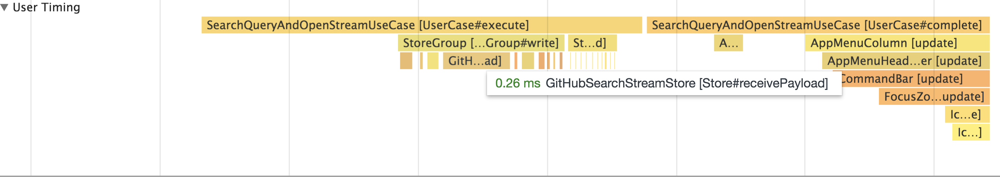

# Performance profile

> Almin 1.4.0+

You can profiling UseCase execute, StoreGroup write/read, Store update using the browser developer tool timeline.

The example of profiling result.



## Metrics


| Mark                     | Duration                                 |
| ------------------------ | ---------------------------------------- |
| `[Transaction]`          | From begin to end of `Context#transaction` |
| `[StoreGroup#read]`      | `StoreGroup` read state from all stores(Total of `Store#getState`) |
| `[StoreGroup#write]`     | `StoreGroup` write payload to all stores(Total of `Store#receivePayload`) |
| `[Store#getState]`       | The time is spent of `Store#getState ` for each Store |
| `[Store#receivePayload]` | The time is pent of  `Store#receivePayload` for each Store |
| `[UserCase#execute]`     | From **will execute** to **did executed** for each UseCase |
| `[UserCase#complete]`    | From **did execute** to **complete** for each UseCase |


Related: [UseCase LifeCycle](./usecase-lifecycle.md)

## How to use?

You can turn on performance profile by `performanceProfile` option. 

```js
const appContext = new Context({
    dispatcher: new Dispatcher(),
    store: yourStoreGroup,
    options: {
        strict: true,
        performanceProfile: true
    }
});
```

Turn on by `process.env.NODE_ENV`.

```js
const appContext = new Context({
    dispatcher: new Dispatcher(),
    store: yourStoreGroup,
    options: {
        strict: true,
        performanceProfile: process.env.NODE_ENV !== "production"
    }
});
```

### Steps

1. Turn on `performanceProfile` option
2. Load your app
3. Open the browser DevTools "Performance" tab and press **Record**
    - For more details, See [Chrome's Timeline Tool document](https://developers.google.com/web/tools/chrome-devtools/evaluate-performance/timeline-tool) and [MSEdge's F12 devtools guide](https://docs.microsoft.com/en-us/microsoft-edge/f12-devtools-guide/performance "F12 devtools guide - Performance - Microsoft Edge Development | Microsoft Docs")
4. Stop recording
5. Almin events will be grouped under the **User Timing** label

## Related

- [UseCase LifeCycle](./usecase-lifecycle.md)

## Similar options

- [Vue.js](https://vuejs.org/v2/api/#performance "Vue.js")'s `performance` options
- [React](https://facebook.github.io/react/ "React - A JavaScript library for building user interfaces") and`?react_perf`
    - [Optimizing Performance - React](https://facebook.github.io/react/docs/optimizing-performance.html "Optimizing Performance - React")