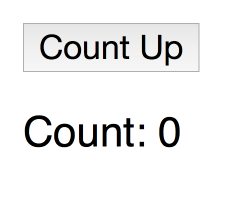
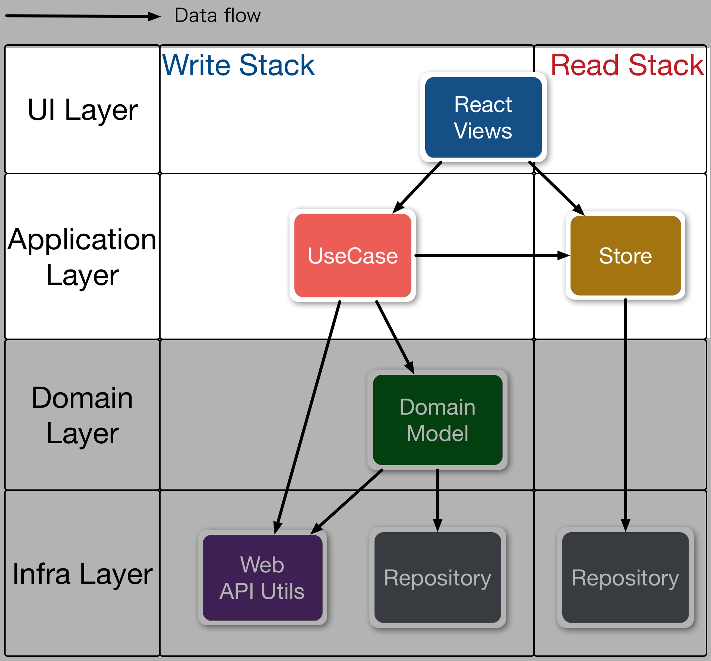

# Counter Example

In this guide, we’ll walk through the process of creating a simple Counter app.



## Source Code

You can get source code for counter app from here

- https://github.com/almin/almin/tree/master/examples/counter

```sh
git clone https://github.com/almin/almin.git

cd almin/examples/counter
npm install
npm start
# manually open
open http://localhost:8080/
```

## The purpose of counter

1. Press button and count up!

End.

### :memo: Notes: Recommendation

1 UseCase = 1 file

## UseCase

We start implementing the UseCase.

> 1. Press button and count up!

Start to create `IncrementalCounterUseCase` class.

```js
"use strict";
import {UseCase} from "almin"
export default class IncrementalCounterUseCase extends UseCase {
    // UseCase should implement #execute method
    execute() {
        // Write the UseCase code
    }
}
```

We want to update **counter app state**, if the `IncrementalCounterUseCase` is executed.

Simply, put **counter app state** to a **Store**.

## Store

Second, We create `CounterStore` class. 

```js
"use strict";
import {Store} from "almin";
export class CounterStore extends Store {
    constructor() {
        super();
        // receive event from UseCase, then update state
    }

    // return state object
    getState() {
        return {
            count: 0 
        }
    }
}
```

Almin's `Store` can receive the dispatched *event* from a UseCase.

:thought_balloon: Image:

1. IncrementalCounterUseCase dispatch "increment" event.
2. CounterStore receive the dispatched "increment" event and update own state.

This pattern is the same Flux architecture.


In flux:

1. dispatch "increment" action via ActionCreator
2. Store receive "increment" action and update own state

## **UseCase** dispatch -> Store
 
Return to `IncrementalCounterUseCase` and add "dispatch increment event"

[include, IncrementalCounterUseCase.js](../../../examples/counter/src/usecase/IncrementalCounterUseCase.js)

A class inherited `UseCase` has `this.dispatch(payload);` method.

`payload` object must have `type` property.

```json
{
    "type": "type"
}
```

is a minimal payload object.

Of course, you can include other property to the payload.

```json
{
    "type": "show",
    "value": "value"
}
```

So, `IncrementalCounterUseCase` dispatch "increment" payload.

## UseCase -> **Store** received

Next, We want to add the feature that can received "increment" payload to `CounterStore`.

A class inherited `Store` can implement `receivePayload` method.


```js
"use strict";
import { Store } from "almin";
export class CounterStore extends Store {
    constructor() {
        super();
        // initial state
        this.state = {
            count: 0
        };
    }

    // receive event from UseCase, then update state
    receivePayload(payload) {
        if(payload.type === "increment"){
            this.state.count++;
        }
    }

    // return the state
    getState() {
        return this.state;
    }
}
```

All that is updating `CounterStore`'s state!

But, We can separate the `state` and `CounterStore` as files.
It means that we can create `CounterState`.

**Store**

- Observe dispatch events and update state
    - Write state: `receivePayload()`
    - Read state: `getState()`

**State**

- It is state!

## State

We have created `CounterState.js`.

`CounterState`s main purpose

- receive "payload" and return state.

[include, CounterState.js](../../../examples/counter/src/store/CounterState.js)

You may have seen the pattern. So, It is **reducer** in the Redux.

- [Reducers | Redux](http://redux.js.org/docs/basics/Reducers.html "Reducers | Redux")
- [Flux | Application Architecture for Building User Interfaces](https://facebook.github.io/flux/docs/flux-utils.html "Flux | Application Architecture for Building User Interfaces")

## Store -> State: NewState

Finally, we have added some code to `CounterStore`

1. Receive dispatched event, then update `CounterState`
2. `CounterStore#getState` return the instance of `CounterState`

A class inherited `Store` has `this.setState()` method that update own state if needed.

[include, CounterStore.js](../../../examples/counter/src/store/CounterStore.js)

### :memo: Note: Testing

We can test above classes independently.

- [almin/examples/counter/test at master · almin/almin](https://github.com/almin/almin/tree/master/examples/counter/test "almin/examples/counter/test at master · almin/almin")

## View Integration

This example use [React](https://facebook.github.io/react/ "React").

### App

We will create `App.js` is the root of component aka. Container component.

And, create `Context` object that is communicator between Store and UseCase.

```js
import {Context, Dispatcher} from "almin";
import {CounterStore} from "../store/CounterStore";
// a single dispatcher
const dispatcher = new Dispatcher();
// initialize store
const counterStore = new CounterStore();
// create store group
const storeGroup = new StoreGroup({
    // stateName : store
    "counter": counterStore
});
// create context
const appContext = new Context({
    dispatcher,
    store: storeGroup
});
```

[include, App.js](../../../examples/counter/src/component/App.js)

```js
appContext.onChange(onChangeHandler);
```

If `CounterStore`'s state is changed(or `emitChange()`ed), call `onChangeHandler`.
`onChangeHandler` do update `App` component's state.

### Counter component

Counter component receive `counterState` and `appContext` via `this.props.`.

```js
CounterComponent.propTypes = {
    appContext: React.PropTypes.instanceOf(Context).isRequired,
    counterState: React.PropTypes.instanceOf(CounterState).isRequired
};
```

## End

We have created simple counter app.

Writing the pattern in this guide is the same of Flux pattern.



Next: We learn domain model and CQRS pattern while creating TodoMVC app.
